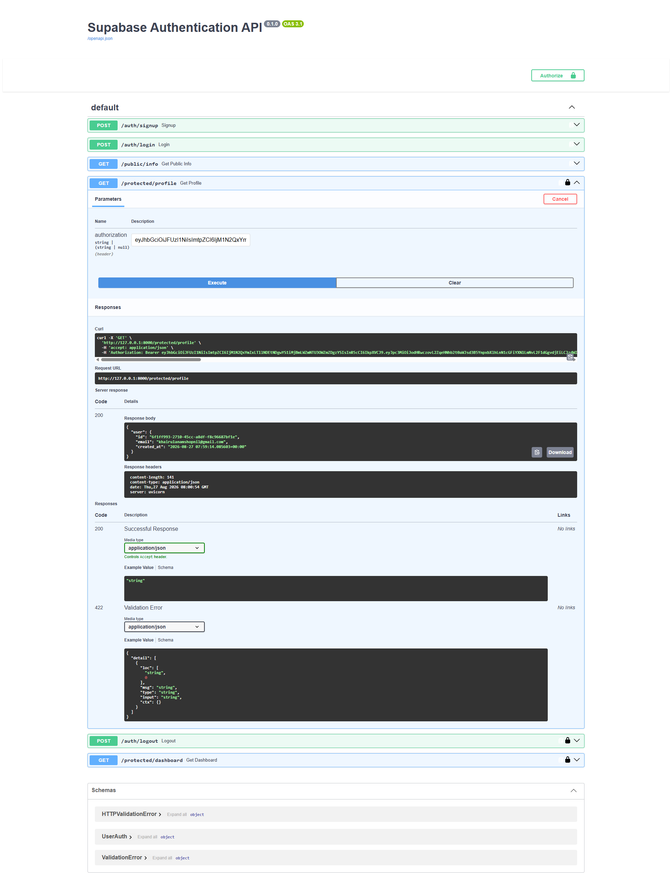

Supabase Authentication API
A lightweight, robust FastAPI backend that handles user authentication and route protection using Supabase Auth and JWT Bearer Tokens. Built with security best practices, full Swagger UI documentation, and reusable FastAPI dependency injection.

Project Overview:
This project provides a standard authentication system for web and mobile applications. It interfaces directly with Supabase's authentication service to manage user registration, login sessions, token generation, and route authorization.

Key Features:
1. User Authentication: Complete Signup and Login flows powered by Supabase Auth.

2. Token Verification: Custom FastAPI dependencies for extracting and verifying JWT Bearer tokens.

3. Protected Routes: Endpoints secured with FastAPI's HTTPBearer security scheme.

4. Interactive Docs: Full Swagger UI integration featuring top-level Bearer Auth support (🔒 lock icon enabled).

Local Setup Instructions:
Follow these steps to get the API running locally in under 5 minutes.
1. Prerequisites
Python 3.9+
A Supabase project (URL and Anon/Public API key)

Clone the Repository & Install Dependencies
```bash
# Clone the repository
git clone [https://github.com/mdshopnil071/fastapi-supabase-auth.git](https://github.com/mdshopnil071/fastapi-supabase-auth.git)
cd fastapi-supabase-auth

# Create and activate a virtual environment
python -m venv venv
# On Windows:
venv\Scripts\activate
# On macOS/Linux:
source venv/bin/activate

# Install required packages
pip install fastapi uvicorn supabase python-dotenv pydantic
```

Environment Variables Setup:
Create a .env file in the root directory of the project:
```bash
touch .env
```
Add your Supabase credentials into .env:

SUPABASE_URL=[https://your-supabase-project-id.supabase.co](https://your-supabase-project-id.supabase.co)


SUPABASE_KEY=your-supabase-anon-key

Note: Make sure .env is listed in your .gitignore file to avoid exposing sensitive keys.

Running the Application
Start the local Uvicorn development server:
```bash
uvicorn main:app --reload --host 0.0.0.0 --port 8000
```
Once running, access the server at http://127.0.0.1:8000

API Reference Table
| Endpoint | Method | Auth Required | Status Code | Description |
| :--- | :---: | :---: | :---: | :--- |
| `/auth/signup` | `POST` | ❌ No | `201 Created` | Registers a new user with email and password. |
| `/auth/login` | `POST` | ❌ No | `200 OK` | Authenticates user and returns JWT access tokens. |
| `/public/info` | `GET` | ❌ No | `200 OK` | Public health check and informational route. |
| `/protected/profile` | `GET` | ✅ Yes | `200 OK` | Fetches the authenticated user's profile info. |
| `/protected/dashboard` | `GET` | ✅ Yes | `200 OK` | Retrieves personalized dashboard metrics. |
| `/auth/logout` | `POST` | ✅ Yes | `204 No Content` | Invalidates current user session on Supabase. |


Interactive API Documentation (Swagger UI)
Access interactive API testing at http://127.0.0.1:8000/docs.

Swagger UI Screenshot

